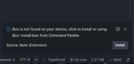

# vscode-bunn

`vscode-bunn` is a all-in-one [Visual Studio Code](https://code.visualstudio.com/) extension that allow developer to run, write, and debug [bun.sh](https://bun.sh) - **fast all-in-one JavaScript runtime** better.

_vscode-bunn is currently on experimental and will be released soon. [Roadmap](https://github.com/PlayerNguyen/vscode-bunn/issues/3)_

- Fast start-up runtime
- Support fully commands

# Features
 ### Install bun directly in editor
 
# License

Under MIT license, by PlayerNguyen and contributors.
[LICENSE](LICENSE)
